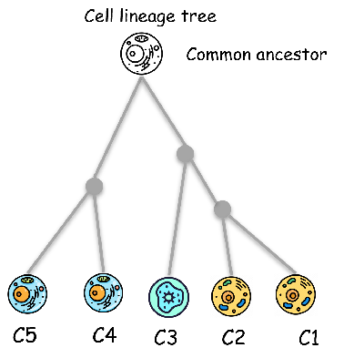
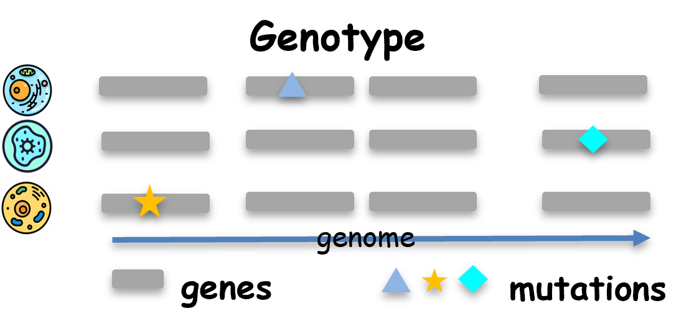
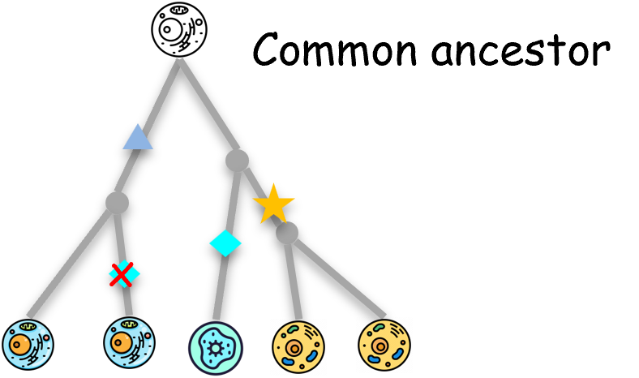
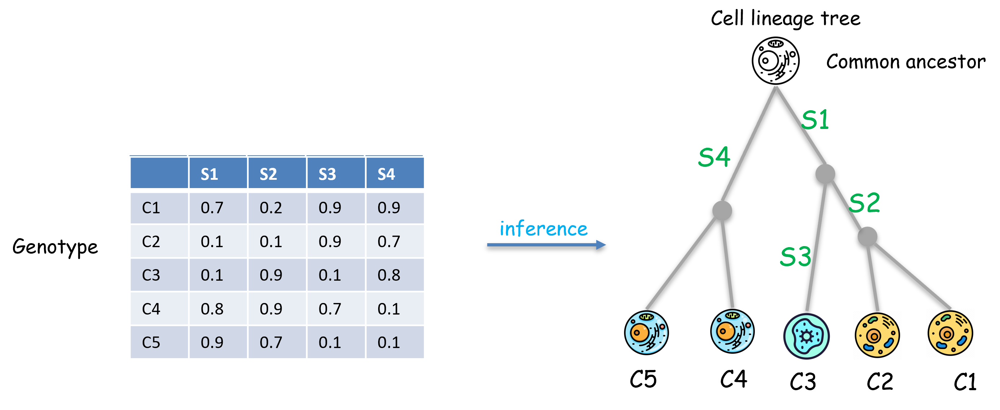
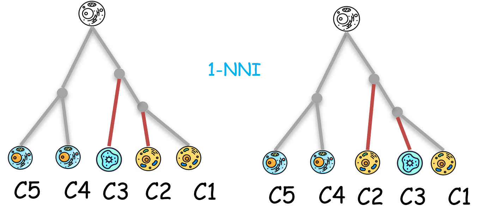
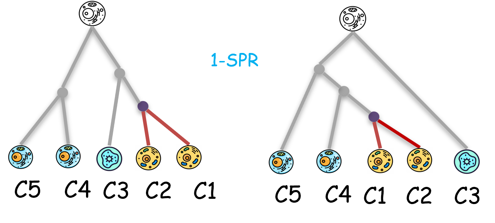

# About
**ScisTree2 is a tool for fast cell lineage tree reconstruction and genotype calling from noisy single-cell DNA sequencing data.**

## Background
#### Cell lineage tree
In a multicellular organism, cell lineages share a common evolutionary history. Knowing this history can facilitate the study of development, aging, and cancer. Cell lineage trees represent the evolutionary history of cells sampled from an organism. 



The figure displays a simple cell lineage tree of five cells ($C_1$ through $C_5$). In this tree, cells $C_1$ and $C_2$ are siblings, as are $C_4$ and $C_5$. Furthermore, cell $C_3$ is more closely related to the clade $(C_1,C_2)$ than to the clade $(C_4,C_5)$.


#### Single-cell DNA-seq
Recent developments in single-cell sequencing have greatly facilitated the inference of cell lineage trees. However, single-cell data are sparse and noisy, and the size of single-cell data is increasing rapidly. Accurate inference of cell lineage tree from noisy single-cell data is computationally challenging, 
There are some common types of errors:
- Allelic dropout
- Sequencing error
- Coverage
- Doublet
- Copy number varation


#### Genotype and Infinite-Site(IS) model
Once the DNA of individual cells has been sequenced, a process called variant calling is used to identify mutation sites. This is done by comparing each cell's DNA sequence against a reference genome.



At each identified mutation site (Single Nucleotide Variant), the cell's genetic state (allele) is assigned a binary value:
* 0 (Wild-Type): The allele is identical to the reference genome.
* 1 (Mutant): The allele differs from the reference genome.

A cell's overall genotype is therefore defined as the set of binary values describing its state across all relevant mutation sites.

When these acquired mutations are mapped onto the branches of a cell lineage tree, the developmental relationships between cells become clear. This mapping reveals how mutations are passed down and accumulate through generations of cell division. In this context, a clade is a group of cells that all share a common set of mutations inherited from a single ancestor.



A key assumption often used in these analyses is the Infinite Sites (IS) model. This model assumes that a mutation at any specific genomic location can occur only once throughout the entire history of the lineage. Consequently, the exact same mutation cannot arise independently in different branches (an event known as homoplasy), nor can a mutant allele revert to the wild-type state. 
```{note}
As the figure illustrates, the "repeated blue diamond" appearing on separate lineages would violate the assumptions of the IS model, which is not allowed.
```

#### What is ScisTree2
ScisTree2 is a fast and accurate method for cell lineage tree inference and genotype calling based on the infinite-sites model. Since genotypes called from single-cell DNA sequencing data are often noisy and inaccurate, ScisTree2 begins with this noisy input and infers the most likely cell lineage tree while simultaneously correcting the genotypes. It employs an efficient local search algorithm to identify optimal tree structures. Notably, ScisTree2 is the first model-based approach capable of handling datasets containing tens of thousands of cells or more, making it highly scalable for large-scale single-cell analyses.



This figure illustrates an example of noisy genotypes for 5 cells across 4 SNV sites. Each value represents the probability of a site being wild-type (0). After running ScisTree2, a cell lineage tree is inferred, and mutations are mapped onto its branches. 
```{note}
As shown, the genotype of cell $C_3$ at site $S_1$ is noisy, it has only a 10% probability of being wild-type (0), but is very likely to be mutant (1) as the inferred tree indicates. Mutation of $S_1$ is placed on the branch to the lowest common ancestor of $C_1$, $C_2$, and $C_3$, so all of them have 1 at $S_1$.
```
#### Algorithm overview
ScisTree2 uses a heurastic way to find the optimal tree: 
1. start from an initial tree (say built by neighbor joining)
2. move to the best neighboring tree (with highest probability) of current tree by rearranging the current tree by NNI* or SPR*
3. repeated util converge

Nearest neighbor interchange  (NNI): swap adjacent branches


Subtree prune and regraft (SPR): move a subtree to another (possible very far) location. 


